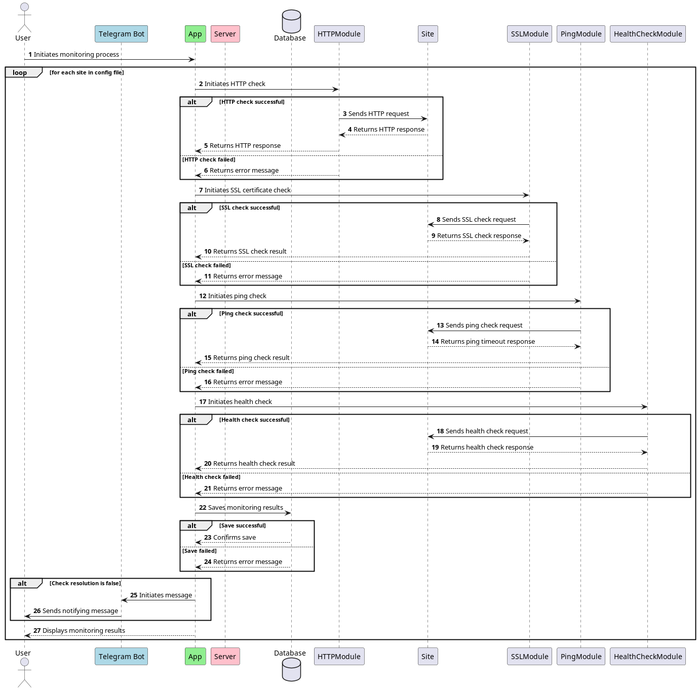

# Uptime Monitor
An uptime monitoring tool to check the workability of sites with error notification. The tool is written in TypeScript and uses Prisma ORM to work with the database. The tool can check the site status by HTTP, ping, SSL certificate, and health check. The tool can send notifications to Telegram chat.

# How it works
Here is the sequence diagram showing objects lifecycle and the checking workability processes:

# Get started
1) Clone this repository to your local machine:
bash
`git clone https://gitlab.com/daria_smyr/uptime-monitor.git`
2) Install the necessary dependencies:`npm install`
3) cp `src/config/config-example.ts` to `src/config/config.ts`
4) Edit `config.ts`: 
  
- `db.filePath` - path to the database file
- `telegram.apiKey` - Telegram bot API key
- `telegram.chatId` - Telegram chat ID
- `telegram.dryRun` - if `true`, the bot will not send messages to the chat
- `keepLastRecordCount` - the number of records to keep in the database
- `oldRecordsDeleteIntervalMs` - the interval in milliseconds to delete old records from the database
- `port` - the port to run the server on
- `sslTimeoutMs` - the timeout in milliseconds to check the SSL certificate
- `sites` - the array of sites to monitor
- `sites.url` - the URL of the site to monitor
- `sites.intervalMs` - the interval in milliseconds to check the site
- `sites.checkMethods` - the array of methods to check the site: `http`, `ping`, `ssl`, `health`
- `sites.healthSlug` - the slug to check the site health
- `sites.responseBody` - the expected response body
- `sites.statusCode` - the expected status code

5) Save your results with Prisma ORM by updating the Prisma configuration in `prisma/schema.prisma`.
6) Run `npm run build && npm start` to start the app.

## Structure description

- `src` directory contains the main project files. There is a following structure:
- `src/config` - directory with project settings, contains `config.ts`, that are used in production
  and `config-example.ts` as example for development
- `data` - directory with data files, such as database, logs, etc.

## Database workflow with Prisma
- Edit schema in `prisma/schema.prisma`
- Run `npm run db:create` to create the database
- Run `npm run db:generate` to generate the Prisma client
- Run `npm run db:studio` to open Prisma Studio
- Run `npm run db:format` to format the schema

### `package.json` scripts
- `npm run build` - build the project
- `npm run start` - start the project
- `npm run dev` - start the project in development mode (auto restart on code changed)
- `npm run db:create` - create the database
- `npm run db:generate` - generate the Prisma client
- `npm run db:studio` - open Prisma Studio
- `npm run db:format` - format the schema
- `npm run lint` - run ESlint
- `npm run lint:fix` - run ESlint with autofix
- `npm run test` - run tests

